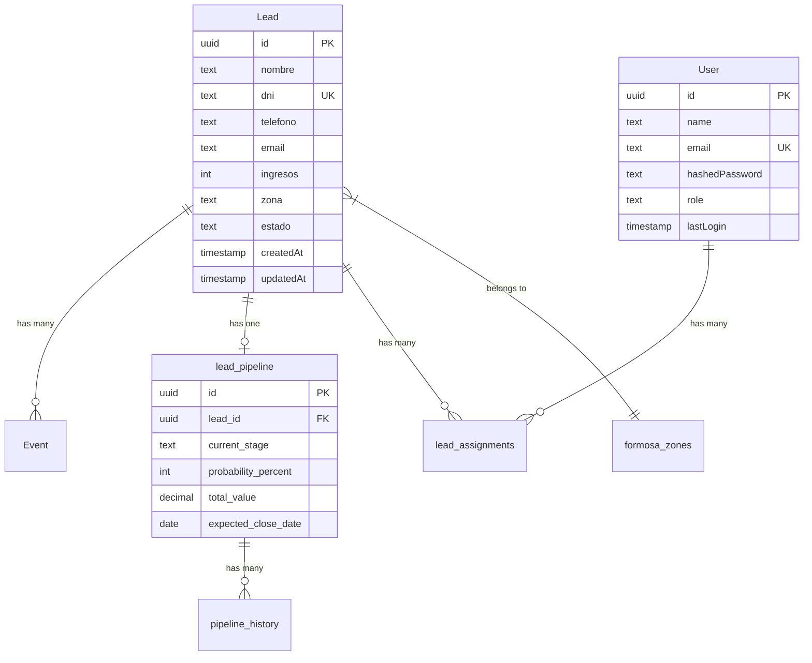

# 🏗️ Arquitectura del Sistema - CRM Phorencial

> **Versión:** 0.9.0  
> **Última actualización:** Octubre 2025  
> **Arquitectura:** Moderna, basada en componentes

---

## 📊 Visión General

CRM Phorencial está construido con una **arquitectura moderna de 3 capas** utilizando Next.js 14 con App Router, lo que permite renderizado del lado del servidor (SSR), generación estática (SSG) y renderizado del lado del cliente (CSR) según sea necesario.

```
┌─────────────────────────────────────────────────────────┐
│                      FRONTEND LAYER                      │
│                                                          │
│  ┌──────────┐  ┌──────────┐  ┌──────────┐  ┌─────────┐│
│  │Dashboard │  │  Leads   │  │ Pipeline │  │Settings ││
│  │   UI     │  │   UI     │  │    UI    │  │   UI    ││
│  └────┬─────┘  └────┬─────┘  └────┬─────┘  └────┬────┘│
│       │             │              │              │     │
│       └─────────────┴──────────────┴──────────────┘     │
│                         │                               │
└─────────────────────────┼───────────────────────────────┘
                          │
┌─────────────────────────┼───────────────────────────────┐
│                    API LAYER                             │
│                         │                                │
│  ┌─────────────────────▼─────────────────────┐          │
│  │      Next.js API Routes (39 endpoints)    │          │
│  └─────────────────────┬─────────────────────┘          │
│                         │                                │
│  ┌────────────┬────────┴────────┬────────────┐          │
│  │  /leads    │  /pipeline      │  /auth     │          │
│  │  /dashboard│  /webhooks      │  /rules    │          │
│  └────────────┴─────────────────┴────────────┘          │
└─────────────────────────┼───────────────────────────────┘
                          │
┌─────────────────────────┼───────────────────────────────┐
│                 DATABASE LAYER                           │
│                         │                                │
│  ┌─────────────────────▼─────────────────────┐          │
│  │         Supabase PostgreSQL                │          │
│  │  ┌──────────┐  ┌──────────┐  ┌─────────┐ │          │
│  │  │  Leads   │  │  Users   │  │ Events  │ │          │
│  │  │ Pipeline │  │  Rules   │  │ History │ │          │
│  │  └──────────┘  └──────────┘  └─────────┘ │          │
│  └───────────────────────────────────────────┘          │
└─────────────────────────────────────────────────────────┘
```

---

## 🎯 Stack Tecnológico Detallado

### Frontend Stack

```typescript
{
  "framework": "Next.js 14.2.15",
  "runtime": "React 18",
  "language": "TypeScript 5",
  "styling": {
    "framework": "Tailwind CSS 3.3",
    "components": "shadcn/ui + Radix UI",
    "icons": "Lucide React"
  },
  "state": {
    "server": "React Query (TanStack Query)",
    "client": "React useState/useReducer",
    "forms": "React Hook Form"
  },
  "validation": "Zod 3.25",
  "charts": "Recharts 3.1"
}
```

### Backend Stack

```typescript
{
  "api": "Next.js API Routes",
  "database": "Supabase PostgreSQL",
  "client": "Supabase JS Client",
  "auth": "NextAuth.js 4.24",
  "security": {
    "jwt": "NextAuth JWT",
    "bcrypt": "bcryptjs",
    "rls": "Supabase Row Level Security"
  }
}
```

### Testing Stack

```typescript
{
  "e2e": "Playwright 1.55",
  "unit": "Jest 30 + Vitest 3.2",
  "coverage": "Jest Coverage",
  "browsers": ["Chromium", "Firefox", "WebKit", "Mobile"]
}
```

---

## 📁 Estructura de Carpetas

```
phorencial-bot-crm/
│
├── src/                           # Código fuente principal
│   ├── app/                       # Next.js App Router
│   │   ├── (dashboard)/           # Grupo de rutas del dashboard
│   │   │   ├── dashboard/         # Página principal
│   │   │   ├── leads/             # Gestión de leads
│   │   │   ├── pipeline/          # Pipeline de ventas
│   │   │   ├── documents/         # Documentos
│   │   │   └── settings/          # Configuración
│   │   ├── api/                   # API Routes (39 endpoints)
│   │   │   ├── leads/             # CRUD de leads
│   │   │   ├── pipeline/          # Pipeline endpoints
│   │   │   ├── auth/              # Autenticación
│   │   │   ├── dashboard/         # Métricas
│   │   │   └── webhooks/          # Webhooks externos
│   │   ├── auth/                  # Páginas de auth
│   │   └── layout.tsx             # Layout raíz
│   │
│   ├── components/                # Componentes reutilizables
│   │   ├── dashboard/             # Componentes del dashboard
│   │   ├── leads/                 # Componentes de leads
│   │   ├── pipeline/              # Componentes de pipeline
│   │   ├── layout/                # Layouts (Sidebar, Header)
│   │   └── ui/                    # Componentes shadcn/ui
│   │
│   ├── lib/                       # Librerías y utilidades
│   │   ├── auth.ts                # Configuración NextAuth
│   │   ├── db.ts                  # Cliente Supabase
│   │   ├── validators.ts          # Esquemas Zod
│   │   └── utils.ts               # Funciones auxiliares
│   │
│   ├── server/                    # Lógica del servidor
│   │   ├── services/              # Servicios de negocio
│   │   └── repositories/          # Acceso a datos
│   │
│   ├── types/                     # Definiciones TypeScript
│   ├── hooks/                     # Custom React hooks
│   └── middleware.ts              # Middleware de Next.js
│
├── docs/                          # Documentación
├── scripts/                       # Scripts de utilidad (51)
├── tests/                         # Tests E2E
├── e2e/                           # Tests de integración
├── prisma/                        # Schema Prisma (legacy)
└── public/                        # Archivos estáticos
```

---

## 🔄 Flujo de Datos

### 1. Flujo de Lectura de Datos

```
┌─────────────┐
│   Usuario   │
└──────┬──────┘
       │
       │ 1. Navega a /dashboard
       ▼
┌─────────────────┐
│  Next.js Page   │ ← Componente React Server
└────────┬────────┘
         │
         │ 2. Fetch data
         ▼
┌─────────────────┐
│   API Route     │ ← /api/dashboard/metrics
│  /api/metrics   │
└────────┬────────┘
         │
         │ 3. Query DB
         ▼
┌─────────────────┐
│ Supabase Client │
│    (db.ts)      │
└────────┬────────┘
         │
         │ 4. SQL Query
         ▼
┌─────────────────┐
│   PostgreSQL    │
│   (Supabase)    │
└────────┬────────┘
         │
         │ 5. Return data
         ▼
┌─────────────────┐
│   API Route     │ ← Transform & validate
└────────┬────────┘
         │
         │ 6. JSON Response
         ▼
┌─────────────────┐
│   React UI      │ ← Render
└─────────────────┘
```

### 2. Flujo de Escritura de Datos

```
┌─────────────┐
│   Usuario   │
└──────┬──────┘
       │
       │ 1. Submit form
       ▼
┌─────────────────┐
│  React Form     │ ← Validación cliente (Zod)
│ (React Hook     │
│    Form)        │
└────────┬────────┘
         │
         │ 2. POST /api/leads
         ▼
┌─────────────────┐
│   API Route     │ ← Validación servidor (Zod)
│  /api/leads     │   Autenticación (JWT)
└────────┬────────┘
         │
         │ 3. Create lead
         ▼
┌─────────────────┐
│ Lead Service    │ ← Lógica de negocio
└────────┬────────┘
         │
         │ 4. Insert
         ▼
┌─────────────────┐
│   Supabase      │ ← RLS check
│   PostgreSQL    │
└────────┬────────┘
         │
         │ 5. Success
         ▼
┌─────────────────┐
│  Create Event   │ ← Audit log
└────────┬────────┘
         │
         │ 6. Return lead
         ▼
┌─────────────────┐
│   React UI      │ ← Update & redirect
└─────────────────┘
```

---

## 🔐 Arquitectura de Autenticación

```
┌──────────────────────────────────────────────────────┐
│                   NextAuth.js                         │
├──────────────────────────────────────────────────────┤
│                                                       │
│  ┌────────────────┐      ┌────────────────────┐     │
│  │  Credentials   │      │   JWT Strategy     │     │
│  │   Provider     │─────▶│  (Stateless Auth)  │     │
│  └────────┬───────┘      └────────────────────┘     │
│           │                                          │
│           ▼                                          │
│  ┌─────────────────────────────────┐                │
│  │   Custom Authorize Function     │                │
│  │  1. Validate credentials        │                │
│  │  2. Check Supabase User table   │                │
│  │  3. Verify password (bcrypt)    │                │
│  │  4. Return user + role          │                │
│  └─────────────────────────────────┘                │
│                                                       │
└──────────────────────────────────────────────────────┘
                      │
                      ▼
┌──────────────────────────────────────────────────────┐
│               Session & Token                         │
├──────────────────────────────────────────────────────┤
│  {                                                    │
│    user: {                                            │
│      id: "uuid",                                      │
│      email: "user@example.com",                       │
│      name: "Usuario",                                 │
│      role: "ADMIN" | "ANALISTA" | "VENDEDOR",        │
│      status: "ACTIVE"                                 │
│    }                                                  │
│  }                                                    │
└──────────────────────────────────────────────────────┘
```

### RBAC (Role-Based Access Control)

| Rol | Permisos |
|-----|----------|
| **ADMIN** | Acceso completo, gestión de usuarios, configuración |
| **MANAGER** | Gestión de leads, pipeline, reportes, asignaciones |
| **ANALISTA** | Ver y editar leads, acceso a reportes |
| **VENDEDOR** | Ver y editar sus leads asignados |
| **VIEWER** | Solo lectura de datos |

---

## 🗄️ Arquitectura de Base de Datos

### Modelo de Datos Principal



### Tablas Principales

| Tabla | Propósito | Registros Estimados |
|-------|-----------|---------------------|
| `Lead` | Leads del CRM | 233+ (creciendo) |
| `User` | Usuarios del sistema | 4-50 |
| `Event` | Auditoría y eventos | Miles |
| `lead_pipeline` | Pipeline de ventas | 1 por lead |
| `pipeline_history` | Historial de pipeline | Muchos |
| `formosa_zones` | Zonas de Formosa | 20 (fijo) |
| `pipeline_stages` | Etapas del pipeline | 9 (configurable) |
| `Rule` | Reglas de negocio | 10-30 |

---

## 🔌 Arquitectura de APIs

### Estructura de Endpoints

```
/api/
├── leads/
│   ├── GET    /api/leads              # Listar leads (con filtros)
│   ├── POST   /api/leads              # Crear lead
│   ├── GET    /api/leads/[id]         # Obtener lead
│   ├── PATCH  /api/leads/[id]         # Actualizar lead
│   ├── DELETE /api/leads/[id]         # Eliminar lead
│   └── GET    /api/leads/[id]/events  # Eventos del lead
│
├── pipeline/
│   ├── GET    /api/pipeline                    # Listar pipelines
│   ├── POST   /api/pipeline                    # Crear pipeline
│   ├── GET    /api/pipeline/[leadId]           # Pipeline específico
│   ├── POST   /api/pipeline/leads/[leadId]/move # Mover etapa
│   └── GET    /api/pipeline/[leadId]/history   # Historial
│
├── dashboard/
│   └── GET    /api/dashboard/metrics  # Métricas del dashboard
│
├── auth/
│   └── POST   /api/auth/[...nextauth] # NextAuth endpoints
│
├── webhooks/
│   └── POST   /api/webhooks/whatsapp  # Webhook de WhatsApp
│
└── admin/
    ├── GET    /api/admin/users        # Listar usuarios
    ├── POST   /api/admin/users        # Crear usuario
    └── PATCH  /api/admin/users/[id]   # Actualizar usuario
```

### Patrón de API Route

```typescript
// src/app/api/leads/route.ts
import { NextRequest, NextResponse } from 'next/server';
import { getServerSession } from 'next-auth';
import { authOptions } from '@/lib/auth';
import { supabase } from '@/lib/db';
import { leadSchema } from '@/lib/validators';

export async function GET(req: NextRequest) {
  // 1. Autenticación
  const session = await getServerSession(authOptions);
  if (!session) {
    return NextResponse.json({ error: 'Unauthorized' }, { status: 401 });
  }
  
  // 2. Extraer parámetros
  const searchParams = req.nextUrl.searchParams;
  const page = parseInt(searchParams.get('page') || '1');
  const limit = parseInt(searchParams.get('limit') || '10');
  
  try {
    // 3. Lógica de negocio
    const result = await supabase.findManyLeads({ page, limit });
    
    // 4. Respuesta
    return NextResponse.json(result);
  } catch (error) {
    // 5. Manejo de errores
    return NextResponse.json(
      { error: 'Internal server error' },
      { status: 500 }
    );
  }
}

export async function POST(req: NextRequest) {
  const session = await getServerSession(authOptions);
  if (!session) {
    return NextResponse.json({ error: 'Unauthorized' }, { status: 401 });
  }
  
  try {
    const body = await req.json();
    
    // Validación con Zod
    const validatedData = leadSchema.parse(body);
    
    // Crear lead
    const lead = await supabase.createLead(validatedData);
    
    // Crear evento de auditoría
    await supabase.createEvent({
      leadId: lead.id,
      tipo: 'lead_created',
      payload: JSON.stringify({ userId: session.user.id })
    });
    
    return NextResponse.json(lead, { status: 201 });
  } catch (error) {
    if (error instanceof z.ZodError) {
      return NextResponse.json(
        { error: 'Validation error', details: error.errors },
        { status: 400 }
      );
    }
    return NextResponse.json(
      { error: 'Internal server error' },
      { status: 500 }
    );
  }
}
```

---

## 🎨 Arquitectura de UI

### Composición de Componentes

```
Page
└── Layout
    ├── Sidebar
    │   ├── Logo
    │   ├── NavMenu
    │   └── UserProfile
    ├── Header
    │   ├── Breadcrumb
    │   └── UserMenu
    └── Content
        └── Feature Component
            ├── Data Table
            │   ├── Table Header
            │   ├── Table Body
            │   │   └── Table Row
            │   │       └── Table Cell
            │   └── Pagination
            └── Actions
                ├── Button
                └── Dialog
                    └── Form
```

### Patrón de Componente

```typescript
// src/components/leads/LeadCard.tsx
import { Lead } from '@/types';
import { Badge } from '@/components/ui/badge';
import { Card } from '@/components/ui/card';

interface LeadCardProps {
  lead: Lead;
  onEdit?: (lead: Lead) => void;
  onDelete?: (id: string) => void;
}

export function LeadCard({ lead, onEdit, onDelete }: LeadCardProps) {
  return (
    <Card className="p-4">
      <div className="flex justify-between">
        <div>
          <h3 className="font-semibold">{lead.nombre}</h3>
          <p className="text-sm text-muted-foreground">{lead.telefono}</p>
        </div>
        <Badge variant={getStatusVariant(lead.estado)}>
          {lead.estado}
        </Badge>
      </div>
      {/* ... */}
    </Card>
  );
}
```

---

## 🔄 Patrones de Diseño Utilizados

### 1. Repository Pattern

```typescript
// Abstracción del acceso a datos
class LeadRepository {
  async findById(id: string): Promise<Lead | null> {
    return supabase.findLeadById(id);
  }
  
  async findMany(filters: LeadFilters): Promise<Lead[]> {
    return supabase.findManyLeads(filters);
  }
  
  async create(data: CreateLeadDto): Promise<Lead> {
    return supabase.createLead(data);
  }
}
```

### 2. Service Pattern

```typescript
// Lógica de negocio separada
class LeadService {
  constructor(private repo: LeadRepository) {}
  
  async createLeadWithPipeline(data: CreateLeadDto) {
    // 1. Crear lead
    const lead = await this.repo.create(data);
    
    // 2. Crear pipeline automático
    await pipelineService.createForLead(lead.id);
    
    // 3. Registrar evento
    await eventService.log('lead_created', lead.id);
    
    return lead;
  }
}
```

### 3. Middleware Pattern

```typescript
// src/middleware.ts
export function middleware(request: NextRequest) {
  const token = request.cookies.get('next-auth.session-token');
  
  if (!token && isProtectedRoute(request.nextUrl.pathname)) {
    return NextResponse.redirect(new URL('/auth/signin', request.url));
  }
  
  return NextResponse.next();
}
```

---

## 📦 Decisiones Arquitectónicas

### 1. ¿Por qué Next.js 14?
- ✅ App Router moderno
- ✅ Server Components para mejor performance
- ✅ API Routes integradas
- ✅ SSR/SSG/CSR flexibles
- ✅ Optimizaciones automáticas

### 2. ¿Por qué Supabase sobre Prisma?
- ✅ Hosting de BD incluido
- ✅ RLS (Row Level Security) integrado
- ✅ Realtime subscriptions
- ✅ Storage incluido
- ✅ Auth alternativo disponible

### 3. ¿Por qué shadcn/ui?
- ✅ Componentes copiables (no NPM)
- ✅ Personalización total
- ✅ Basado en Radix UI (accesible)
- ✅ Diseño moderno
- ✅ TypeScript nativo

### 4. ¿Por qué NextAuth.js?
- ✅ Integración perfecta con Next.js
- ✅ Multiple providers
- ✅ JWT o Database sessions
- ✅ Callbacks personalizables
- ✅ Comunidad activa

---

## 🔮 Arquitectura Futura

### Mejoras Planificadas

1. **Caché con Redis**
   - Reducir llamadas a DB
   - Mejorar tiempos de respuesta
   
2. **WebSockets para Tiempo Real**
   - Notificaciones push
   - Updates en vivo del pipeline
   
3. **Microservicios**
   - Servicio de WhatsApp separado
   - Servicio de Reportes independiente
   
4. **CI/CD**
   - GitHub Actions
   - Tests automáticos
   - Deploy automático

---

## 📚 Referencias

- [Next.js Documentation](https://nextjs.org/docs)
- [Supabase Documentation](https://supabase.com/docs)
- [shadcn/ui Components](https://ui.shadcn.com)
- [React Query](https://tanstack.com/query/latest)

---

**Última actualización:** Octubre 2025

